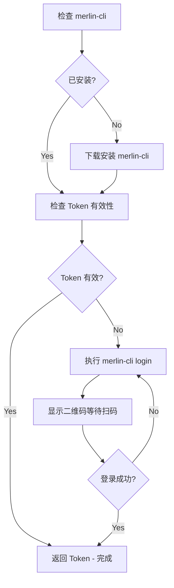

# Merlin API 认证

处理 Merlin MCP API 的认证问题，通过 merlin-cli 进行 SSO 登录获取 JWT Token。

## 触发条件

当出现以下情况时激活此 Skill：

- 调用 Merlin MCP 接口返回 401 Unauthorized
- 调用 Merlin MCP 接口返回 403 Forbidden
- JWT Token 过期或无效
- 需要重新登录

## 控制面 (Control Panel)

Merlin 有多个控制面，对应不同用户群和域名：

| 控制面    | 标识      | 域名                     | 适用用户             |
| --------- | --------- | ------------------------ | -------------------- |
| 中国个人  | `cn`      | `ml.bytedance.net`       | 国内个人用户（默认） |
| 中国 Seed | `cn-seed` | `seed.bytedance.net`     | 国内 Seed 用户       |
| TikTok    | `i18n-tt` | `ml.tiktok-row.net`      | TikTok 海外员工      |
| ByteIntl  | `i18n-bd` | `ml-i18nbd.byteintl.net` | ByteIntl 海外员工    |

### 控制面判断规则

优先根据上下文中出现的域名自动判断控制面，而非直接使用默认值：

1. **检查上下文中的域名**：查看错误信息、API URL、配置文件中出现的域名
   - 包含 `seed.bytedance.net` → 使用 `cn-seed`
   - 包含 `ml.bytedance.net` → 使用 `cn`
   - 包含 `ml.tiktok-row.net` → 使用 `i18n-tt`
   - 包含 `ml-i18nbd.byteintl.net` → 使用 `i18n-bd`
2. **无法判断时**：默认使用 `cn`

所有 merlin-cli 命令都需要指定 `--control-panel <cp>`，例如：

```bash
merlin-cli --control-panel cn job get-run --json '...'
```

Token 按控制面独立存储。

## 认证流程



## 执行步骤

### 步骤 1：检查并安装 merlin-cli

首先检查 merlin-cli 是否已安装：

```bash
merlin-cli --help &>/dev/null
```

如未安装，执行以下命令下载安装：

```bash
curl -fsSL https://ml.bytedance.net/api/agent/system/tos-proxy/merlin-cli/latest/install.sh | bash
```

### 步骤 2：检查 Token 有效性

使用 merlin-cli 测试 token 是否有效：

```bash
# 先根据上下文域名判断控制面，再检查对应控制面的 Token
merlin-cli --control-panel <cp> devbox list --json '{}'
```

**输出解析：**

- Token 有效：返回 devbox 列表（可能为空数组）
- Token 不存在或已过期：
  ```json
  {
    "error": "Token not found",
    "message": "...",
    "hint": "Please run: merlin-cli login"
  }
  ```
  或
  ```json
  {
    "error": "Token expired",
    "message": "...",
    "hint": "Please run: merlin-cli login"
  }
  ```
  → 继续步骤 3 进行登录。

### 步骤 3：执行 merlin-cli login

根据上下文域名判断的控制面执行登录：

```bash
# 默认登录（cn 控制面）
merlin-cli login --control-panel cn

# cn-seed 控制面（上下文包含 seed.bytedance.net）
merlin-cli login --control-panel cn-seed

# TikTok 海外员工（上下文包含 ml.tiktok-row.net）
merlin-cli login --control-panel i18n-tt --oauth2

# ByteIntl 海外员工（上下文包含 ml-i18nbd.byteintl.net）
merlin-cli login --control-panel i18n-bd --oauth2
```

merlin-cli login 会在终端显示二维码，使用飞书扫码完成 SSO 登录。

**交互式登录流程：**

1. 终端显示二维码和登录 URL
2. 使用手机扫描二维码
3. 在手机上确认登录
4. CLI 自动获取并保存 JWT Token

**非交互式登录（AI Agent 使用）：**

```bash
# 生成二维码 URL
merlin-cli login generate-qrcode --control-panel <cp>
# 返回: {"qr_url": "...", "business": "...", "token": "...", "cookies": {...}}

# 轮询登录状态
merlin-cli login check-status --business <business> --token <token> --cookies '<cookies_json>'
# 返回: {"status": "success/pending/expired", "jwt_token": "..."}

# 获取已缓存的 JWT
merlin-cli login get-jwt
```

### 步骤 4：询问用户登录状态

**必须使用 AskUserQuestion 工具**询问用户：

```json
{
  "questions": [
    {
      "question": "请扫描终端中的二维码完成登录。登录完成后请确认。",
      "header": "登录状态",
      "options": [
        {
          "label": "已完成登录",
          "description": "我已扫码完成 SSO 登录"
        },
        {
          "label": "重新登录",
          "description": "登录失败，需要重新尝试"
        }
      ],
      "multiSelect": false
    }
  ]
}
```

- **已完成登录** → 重新检查 token，返回步骤 2
- **重新登录** → 返回步骤 3

### 步骤 5：验证 Token

登录成功后，再次运行测试命令确认 token 有效：

```bash
merlin-cli --control-panel <cp> devbox list --json '{}'
```

## MCP 工具使用

当 MCP 工具不可用时，可以使用 merlin-cli CLI 作为替代。merlin-cli 会动态从 MCP 服务获取所有可用工具。

```bash
# 查看所有可用工具（按分组显示）
merlin-cli list-tools

# 按关键词过滤工具
merlin-cli list-tools --filter <keyword>

# 查看特定工具的参数 Schema
merlin-cli <group> <command> --schema

# 调用示例
merlin-cli job get-run --json '{"job_run_id": "xxx"}'
```

如果出现认证错误（401/403），请运行：`merlin-cli login`

## 错误处理

| 错误信息                | 原因         | 解决方案                |
| ----------------------- | ------------ | ----------------------- |
| `Token not found`       | 从未登录过   | 执行 `merlin-cli login` |
| `Token expired`         | Token 已过期 | 执行 `merlin-cli login` |
| `Authentication failed` | Token 无效   | 执行 `merlin-cli login` |

## 注意事项

1. Token 存储在 `~/.merlin-cli/auth/seed.json` 文件中
2. Token 有过期时间（默认 24 小时），建议在过期前刷新
3. 登录时需要能够访问 ByteDance SSO 服务
4. 可以使用 `merlin-cli upgrade` 命令更新到最新版本
